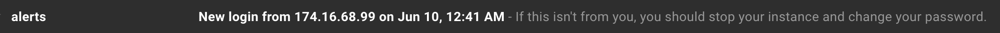

# Private Journal

### About

In a nutshell: a private online journal. A more stripped down version of https://penzu.com (and you really own your data
since you deploy your own instance).

This project is an attempt to make myself journal more
consistently. I find it much easier to gather my thoughts
with a keyboard. Having an online journal also means that
I don't need to remember to bring it with me everywhere. The app
is meant to be used by 1 person, and you can host easily your own instance.

The app is pretty simple: basic CRUD for journal entries and a tagging
system to categorize/search for entries.

### Security

Since journals are really personal and you can't hide your website under the bed
like you can with a physical notebook, there are a couple of security measures built in.

- Even though it is a 1 user app, you still set up a login with a username and password (both are hashed).
- All journal entries/titles/tags are encrypted at the database level using
[OpenSSL::Cipher](https://ruby-doc.org/stdlib-2.4.0/libdoc/openssl/rdoc/OpenSSL/Cipher.html).
- You get an email notification when a login occurs (if you want).

## Hosting your own

I'd recommend using [Heroku](https://heroku.com) since it's super simple to deploy a
Rails app and set up a SendGrid mailer.

### Set up environment variables

###### Required:
- `CIPHER_KEY`: Secret key used in encrypting. It needs to be 32 bytes base 64 encoded.
  - `Base64.encode64(SecureRandom.random_bytes(32))`.
- `TAG_CIPHER_IV`: This is used with to make sure that tag IVs are
the same. This allows us to search on them. It needs to be 16 bytes base 64 encoded.
  - `Base64.encode64(SecureRandom.random_bytes(16))`.

###### For login email alerts:
- `ALERT_EMAIL_RECIPIENT`: Where the alert gets sent to. If this
is missing, emailing will be skipped.
- `SENDGRID_USERNAME`: This is provided by Heroku with the SendGrid add-on.
- `SENDGRID_PASSWORD`: This is provided by Heroku with the SendGrid add-on.
- `MAILER_DOMAIN`: E.g. `"https://example.herokuapp.com"`

### Create a user

- Via Rails console: `User.create!(username: "...", password: "...")`
  - If you ever need to change your username/password: `User.first.update!(username: "...", password: "...")`

That's it! You're good to go.
