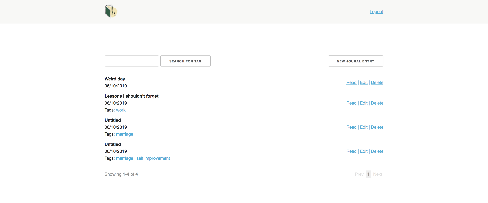
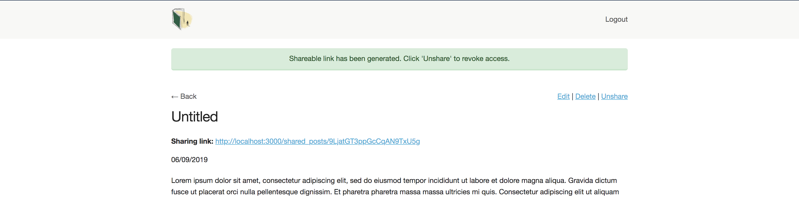
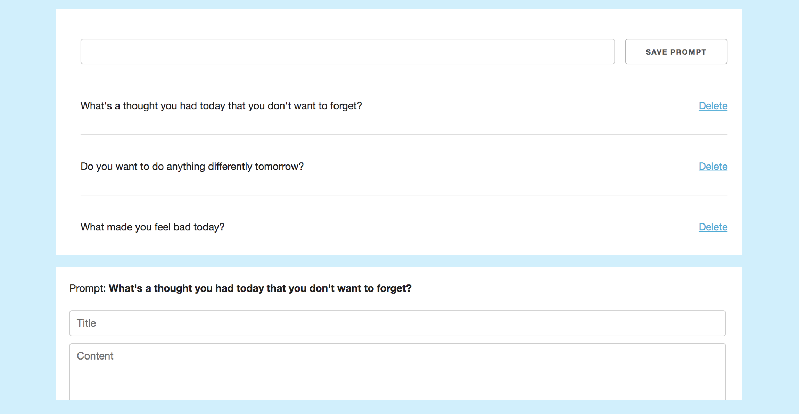
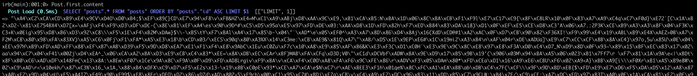
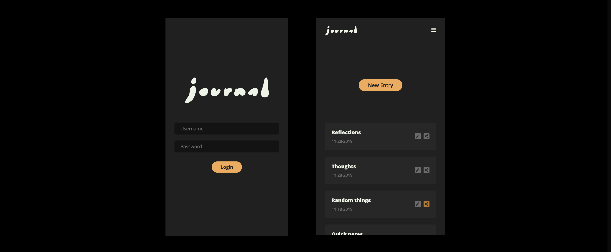

## About

In a nutshell: a private self-hosted journal with sharing capabilities.

This project is an attempt to make myself journal more
consistently. I find it much easier to gather my thoughts
with a keyboard. Having an online journal also means that
I don't need to remember to bring it with me everywhere. The app
is meant to be used by 1 person, and you can host easily your own instance.

The app was designed by [Iana Noda](https://iananoda.com).

## Features

#### Easy on the eyes

The best journaling often happens early in the morning or late at night. To
accomodate this, the entire app has been designed in "dark mode".

#### Sharing capabilities

After writing, sometimes we want to share our thoughts with someone else.
You'll have the option of sharing publicly on a blog-like feed or
sending a secret link to individuals you choose.

#### Customizable journaling prompts

Journaling prompts can help kick-start writing on days where we just can't think
of anything to write about. There is short list of prompts that will be seeded
automatically but the list is completely customizable.

#### Data encryption

Since journals can be very private, we want to be extra careful with its contents.
All journal entry titles/content and prompts are encrypted at the database level
using aes256 encryption.

#### Email alert when a login occurs (optional)

As an optional additional layer of protection, get an email alert whenever there is a login event.

#### Mobile friendly

In case you want to journal while on the go, the entire app is mobile friendly.

## Installation

- [Install with Homebrew](docs/homebrew_install.md)
- [Run with Docker](docs/docker.md)
- [Install on a VPS](docs/vps.md)
- Spin up an instance (for free) using the Heroku deploy button below. Heroku account is required.

### Creating a user

- `bundle exec rails c` to run Rails console
- `User.create!(username: "...", password: "...")` The username and password will be hashed.
- If you ever need to change your username/password: `User.first.update!(username: "...", password: "...")`

## Hosting your own

I'd recommend using [Heroku](https://heroku.com) since it's super simple (and free) to
deploy a Rails app. Keep it awake with my [Heroku Pinger](https://github.com/inoda/heroku-pinger)!
Once your instance is deployed, do the "Creating a user" steps
above after [spinning up Heroku's console](https://devcenter.heroku.com/articles/heroku-dashboard#application-overview).

## Usage and feedback
Feel free to use this however you'd like! If you use this, credit
would be nice but I don't really care that much. I'm primarily maintaining
this for my own use, so I won't be very responsive to issues submitted.
I *will* accept useful pull requests.
